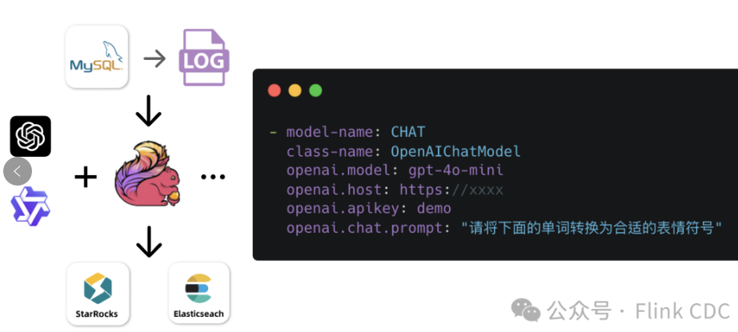

flink1.18文档：https://nightlies.apache.org/flink/flink-docs-release-1.18/zh/docs/connectors/table/jdbc/
flinkcdc3.0文档：https://nightlies.apache.org/flink/flink-cdc-docs-release-3.0/zh/docs/connectors/flink-sources/mysql-cdc/
https://central.sonatype.com/artifact/com.ververica/flink-connector-mysql-cdc/versions

https://python.langchain.com/v0.1/docs/use_cases/sql/agents/

https://pypi.org/project/openai/#description

cdc 3.3.0  此版本不再保证与 Flink 1.18 及更早版本的兼容性。
新功能
1. Transform
    支持在 Transform 表达式中调用 AI Model。目前内置 OpenAI Chat 模型及 Embedding 向量化模型。
    
2. 新增了操作时间戳的 TIMESTAMPADD、TIMESTAMPDIFF、UNIX_TIMESTAMP 内置函数。
3. 支持“逻辑删除”转换功能，将来自上游的 DELETE 事件转换为带特殊标记的 INSERT 事件。
   
Connectors
   适用于 OceanBase 和 MaxCompute 的 Pipeline 连接器现已提供。
   为接入增量快照框架的 CDC 连接器实现了异步分片功能，并完善了 Metrics 支持。
   优化了 CDC 连接器 ROW 类型字段的反序列化效率。
OceanBase Pipeline Connector
OceanBase 是一款原生分布式关系型数据库，具备高性能和高可用性，能够支持海量数据和高并发。现在可以作为 YAML Pipeline Sink 使用。
MaxCompute Pipeline Connector
MaxCompute 是阿里云提供的分布式大数据处理平台，广泛应用于数据分析、报表生成、机器学习等场景。现在可以作为 YAML Pipeline Sink 使用。
Paimon Pipeline Connector支持同步列默认值。支持应用 TRUNCATE TABLE 和 DROP TABLE 事件。更新 Paimon 依赖版本到 0.9.0。
MySQL Connector支持解析 gh-ost 和 pt-osc 等无锁 Schema 变更工具产生的 DDL 变更事件。新增是否将 TINYINT(1) 映射到 BOOLEAN 类型的配置。支持同步表注释及行注释。MySQL CDC 下发的增量数据记录中现在携带 op_ts 元数据列，可以在 Transform 表达式中进行操作。
PostgreSQL CDC Connector减少不必要的 Schema 查询，优化初次启动时间。支持 Heartbeat 心跳包。增加 op_type 元数据列。
Common新增了用于快速搭建数据集成验证环境的 cdc-up 脚本。

缺陷修复
修复了 MySQL CDC 处理新增表时可能的死锁问题。
修复了 MySQL CDC 处理 JSON 类型、带精度 FLOAT 类型的处理行为。
修复了 Paimon Sink 重复 commit 导致作业失败问题。
修复了 Transform 底层实现参数传递顺序问题。
修复了并发执行 Schema Evolution 时作业挂起的问题。
修复了作业失败重启后，Data Sink 内部状态不正确的问题。

[1] https://github.com/apache/flink-cdc/releases/tag/release-3.3.0
[2] https://nightlies.apache.org/flink/flink-cdc-docs-stable
[3] https://flink.apache.org/what-is-flink/community
[4] https://github.com/apache/flink-cdc/discussions
[5] https://issues.apache.org/jira/projects/FLINK/summary

   INITIAL
   执行初始快照，先读取数据库中的全量历史数据
   然后继续读取最新的变更数据
   适用于首次同步，需要历史数据 + 增量数据的场景
   EARLIEST_OFFSET
   从最早的 binlog 位置开始读取
   只读取变更数据，不读取历史数据
   如果 binlog 已被清理，可能会失败
   LATEST_OFFSET
   从最新的 binlog 位置开始读取
   只读取最新的变更数据，不读取历史数据
   适用于只关心最新变更的场景
   SPECIFIC_OFFSETS
   从指定的 binlog 位置开始读取
   可以精确控制从哪个位置开始消费数据
   需要手动指定 binlog 文件名和位置
   TIMESTAMP
   从指定的时间戳开始读取数据
   会从指定时间点最接近的 binlog 位置开始读取
   适用于需要从特定时间点开始同步的场景